# Covid-19 Mapper

A global Covid-19 mapper, made on a single page React App. This used several API calls for the Covid-19 data, and a Google Map API displaying the countries data geographically. Jest and Enzyme was used for testing, Heroku for deployment and Travis for Continuous Integeration. 

---

## How to Run

Clone this repo, navigate to the [_test-app_](test-app) directory and in the command line type:

```
npm install
```

Once the dependencies are installed, type in the command line:

```
npm start
```

This will start the local server which can be accessed at [_localhost:3000_](http://localhost:3000/)

The project is also hosted live on [_Heroku_](https://covid-mapper.herokuapp.com/)

---

## How to Run Tests

Jest and Enzyme were used for testing. To run, in the command line type:


```
npm test
```

This will display all tests (including snapshots).

---

## Development

This was the first large Post-Makers project, and was made with a brand new piece of tech for us. [Asia](https://github.com/asiaellis5), [Nic](https://github.com/nicolasraffray) and I decided to use the React JavaScript library to display the current world data of COVID-19 pandemic. This was for 2 main reasons. Firstly, the best way to learn was by 'doing'. The second was that this was a topic that was affecting us and the world at the time of production. We were quarantined, had a drastic change of pace since graduating, and thought we would try to shed further light on the pandemic situation for the public.

---

### Stage 1
Our MVP, was to have an interactive map that a user can click on to display the current statistics for that country. This took a week to achieve (the original repo can be found [_here_](https://github.com/nicolasraffray/covid-mapper) showing how we got to this point). A user could click on the marker, which would then display the current info in an infowindow from the googlemap API.

---

### Stage 2
The next step was to represent the mortality and infection rates by replacing the markers on the map with circles. These circles would then change in size and colour depending on the data coming in from the Covid API - when clicked on, the data was then changed from being displayed in an infowindow, to being displayed on the bottom of the screen in it's own section that would render independantly. 

 ---

### Stage 3
A separate page was created that shows an interactive table, displaying the data relating to various parameters (Total Cases, Total Deaths, Total Recoveries, CFR, Active Cases, Critical Cases and Cases per 1 Million people). A new table is rendered on click of the 'Covid-19' button, which replaces the map. This can then be filtered through via a real time search bar, or each header of a column can be clicked on to adjust the column to read in an ascending or descending order of respective values. 

---

### Stage 4
We explored the Chart.js library to display the incoming data graphically. The charts are rendered on a seperate page when the menu option is clicked. death of that country.

---

### Stage 5
 We further explored the Chart.js library. The charts were split into two pages - Global charts (showing charts from the world) and Country charts (showing country specific charts). All charts are started from the date of the first recorded 

__Global Charts:__ 

- Confirmed cases, deaths and recoveries to date globally.
- 20 Countries with the highest death count adjusted to deaths per million people of the population (this can be further adjusted to account for population density - per million people per km².
- Daily confirmed cases change, and death change to date globally.
- R value to date globally.
- CFR % to date globally.

__Country Charts:__

Country charts has a search bar. Any country can be typed into this, and the charts that follow will automatically be populated with that countries data.

- Confirmed cases, deaths and recoveries to date for the specified country (can be switched to a doughnut chart to show that country's cases as a % of global cases).
- R value to date for the specified country.
- A comparison graph that populates the chosen country and the 10 countries with the highest confirmed cases in the world. Cases and deaths can then be compared on the same graph to date. (This can also be  adjusted per million people)
- Daily confirmed cases change, and death change to date for the specified country.
- CFR % to date for the specified country .

---

<table>
  <tr>
    <td>Stage 1 - Map View</td>
     <td>Stage 2 - Map View</td>
     <td>Stage 5 - Map View </td>
  </tr>
  <tr>
    <td valign="top"></td>
    <td valign="top">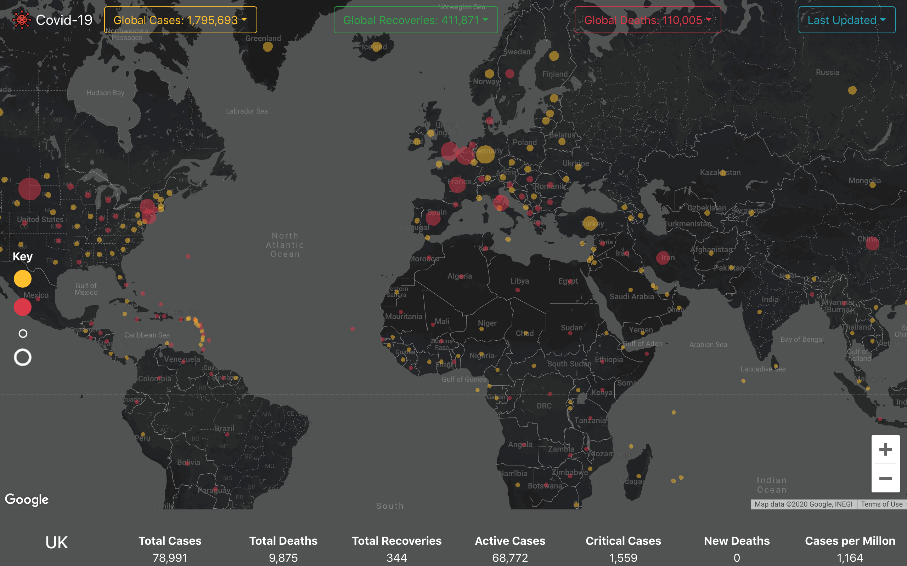</td>
    <td valign="top">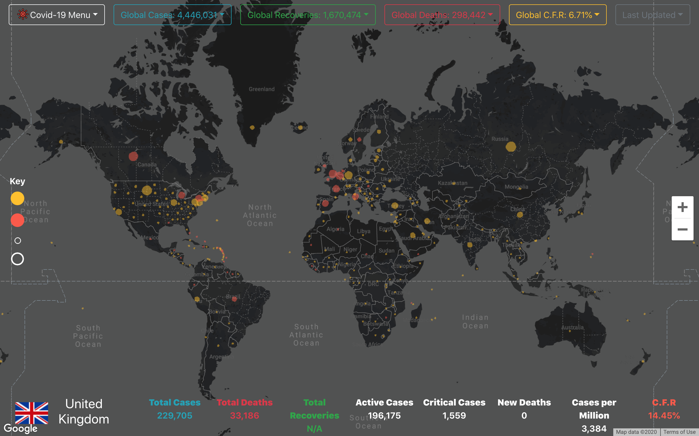</td>
  </tr>
 </table>
<table>

---

### Global Charts

<table>
  <tr>
     <td>Confirmed Cases, Deaths, Recoveries</td>
     <td>Highest Country Deaths per Million</td>
     <td>=> Adjusted for Population Density</td>
  </tr>
  <tr>
    <td valign="top">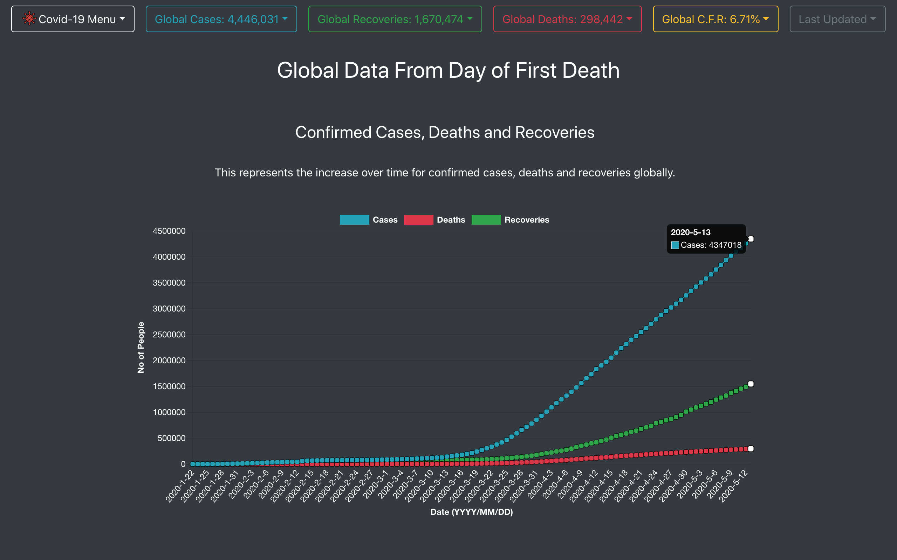</td>
    <td valign="top"></td>
    <td valign="top">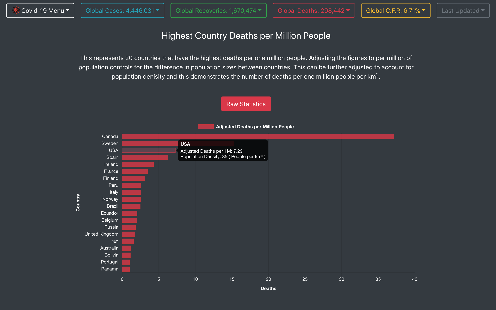</td>
  </tr>
 </table>
<table>

---

<table>
  <tr>
    <td>Daily Case/Death Change</td>
     <td>Growth Factor</td>
      <td>Case Fatality Rate</td>

  </tr>
  <tr>
  <td valign="top">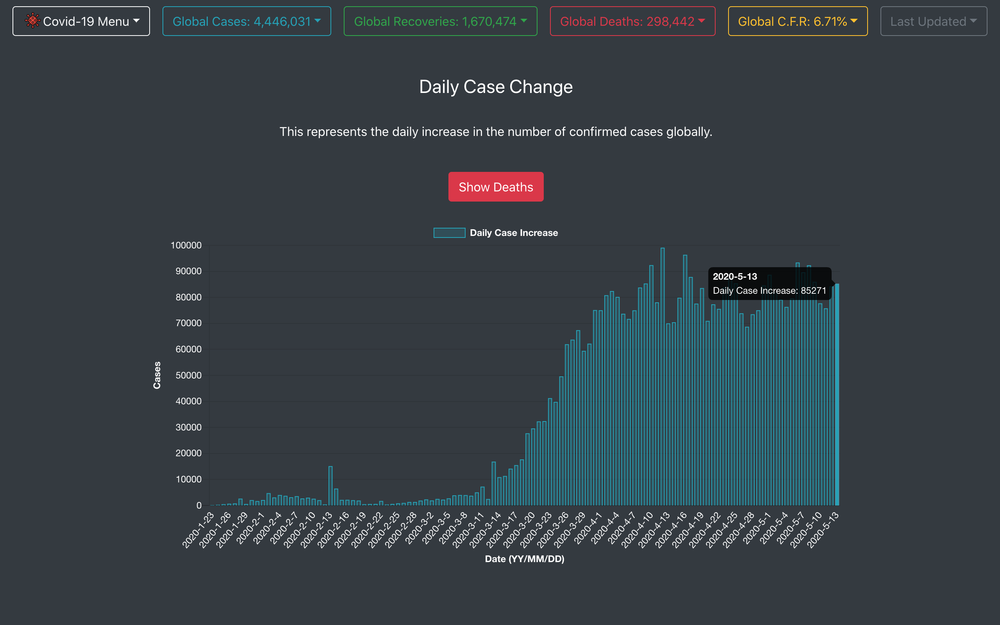</td>
  <td valign="top">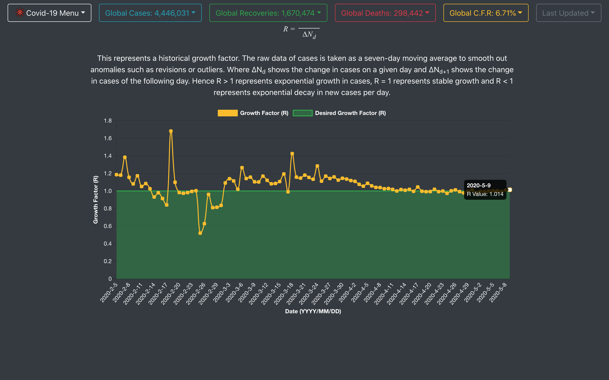</td>
  <td valign="top">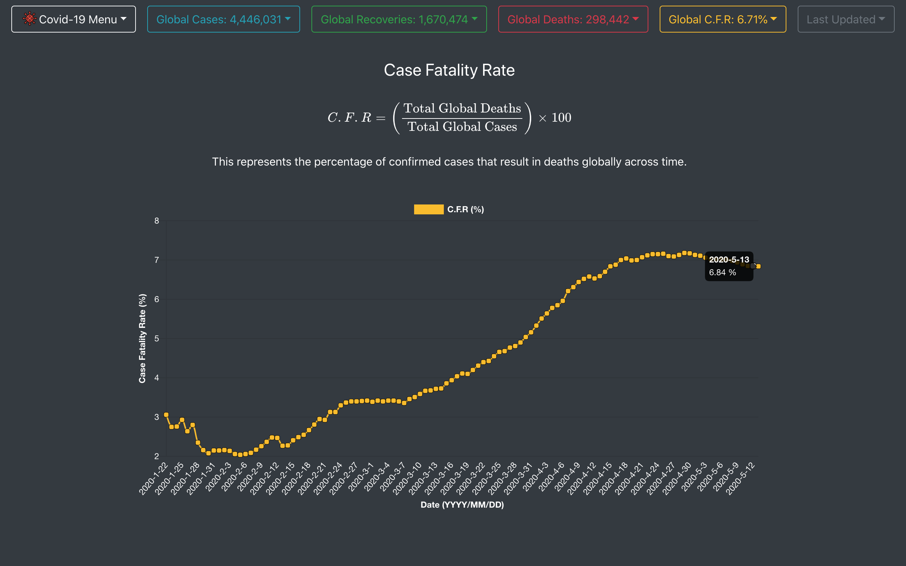</td>
  </tr>
 </table>

 ---

### Country Charts

<table>
  <tr>
     <td>Confirmed Cases, Deaths, Recoveries</td>
     <td>Country % of Global Cases</td>
     <td>Growth Factor</td>
  </tr>
  <tr>
   <td valign="top">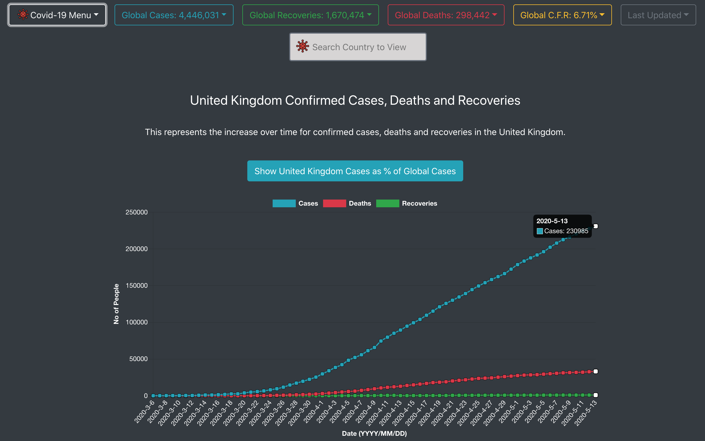</td>
   <td valign="top">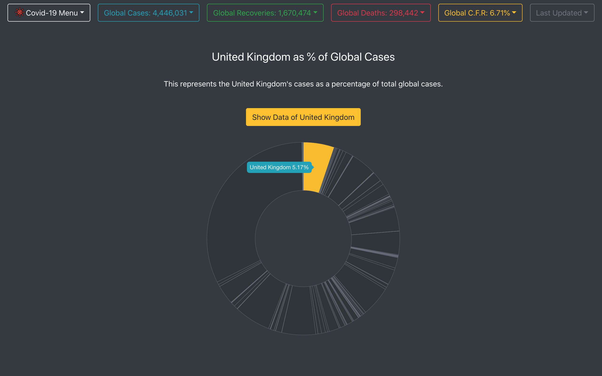</td>
   <td valign="top">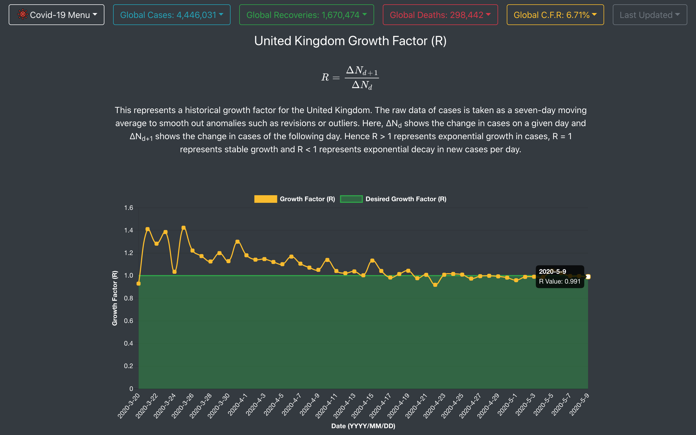</td>
  </tr>
 </table>

 ---

<table>
   <tr>
      <td>Daily Case/Death Change</td>
       <td>Case Fatality Rate</td>
       <td>Table Comparsion</td>
   </tr>
   <tr>
   <td valign="top">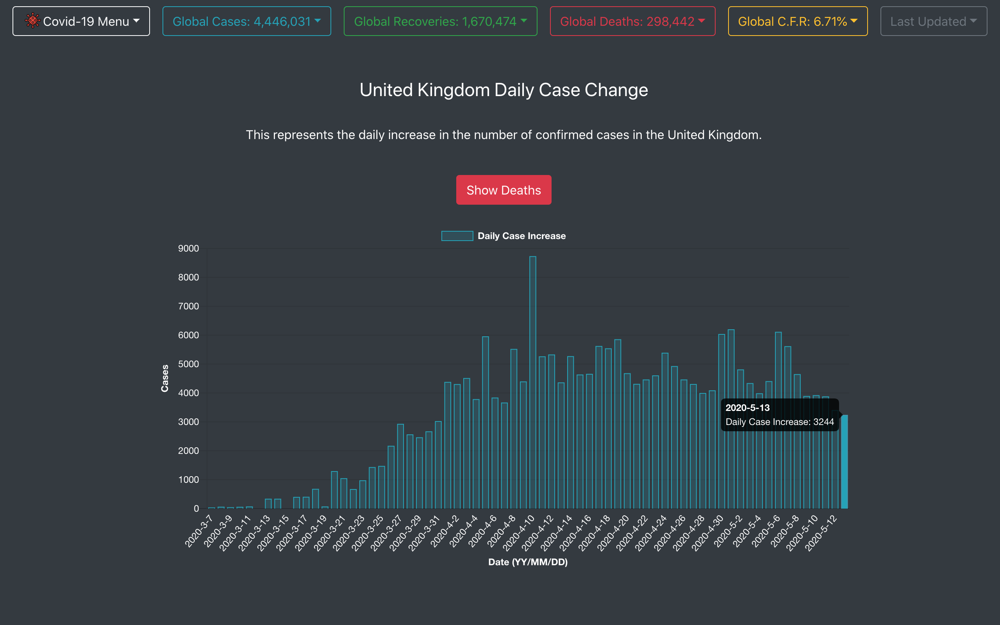</td>
   <td valign="top">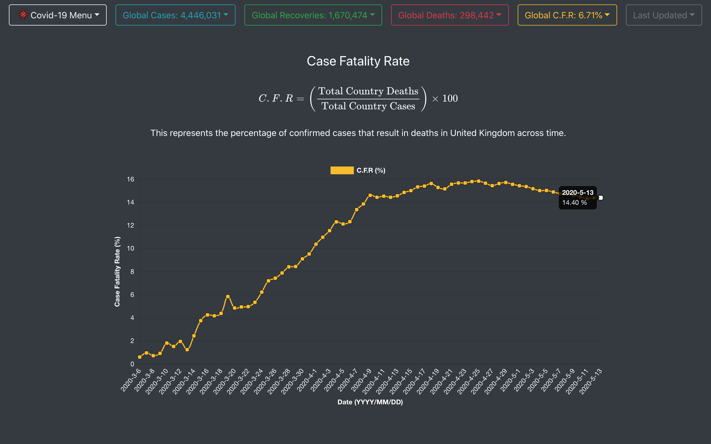</td>
   <td valign="top">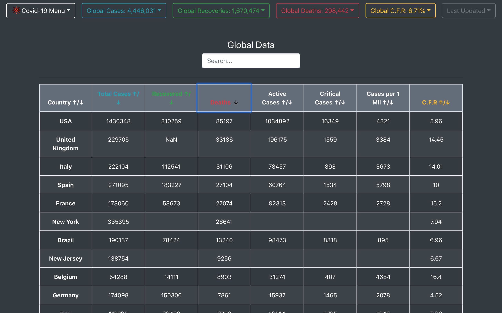</td>
   </tr>
  </table>

  ---

  ### Comparison Charts

  <table>
   <tr>
      <td>Comparison of Cases</td>
       <td>Comparison of Deaths</td>
   </tr>
   <tr>
     <td valign="top">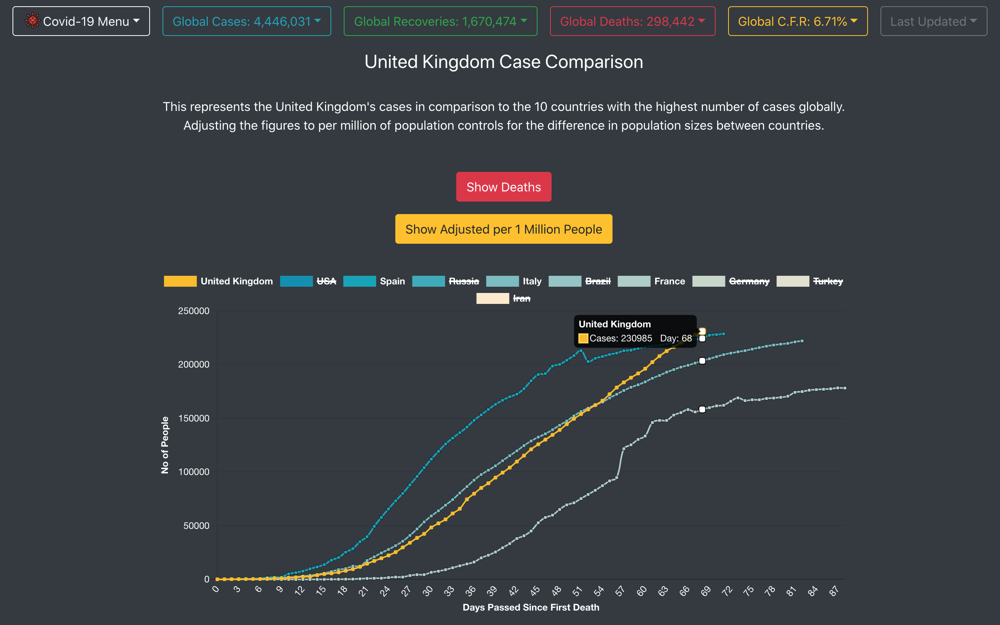</td>
     <td valign="top">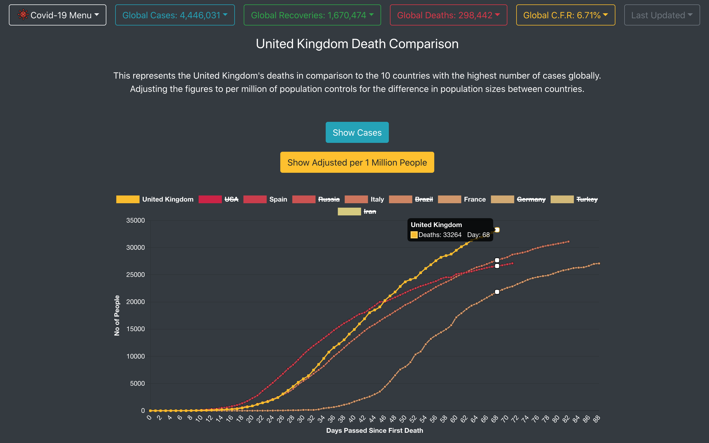</td>
   </tr>
  </table>

---

## Forking This Repo

This site is fully open source so feel free to fork this repo. If you do, please just give us proper credit by linking back to the repo: https://github.com/davidpaps/covid_19_mapper We put blood, sweat and tears into this project and are proud of it! 

---