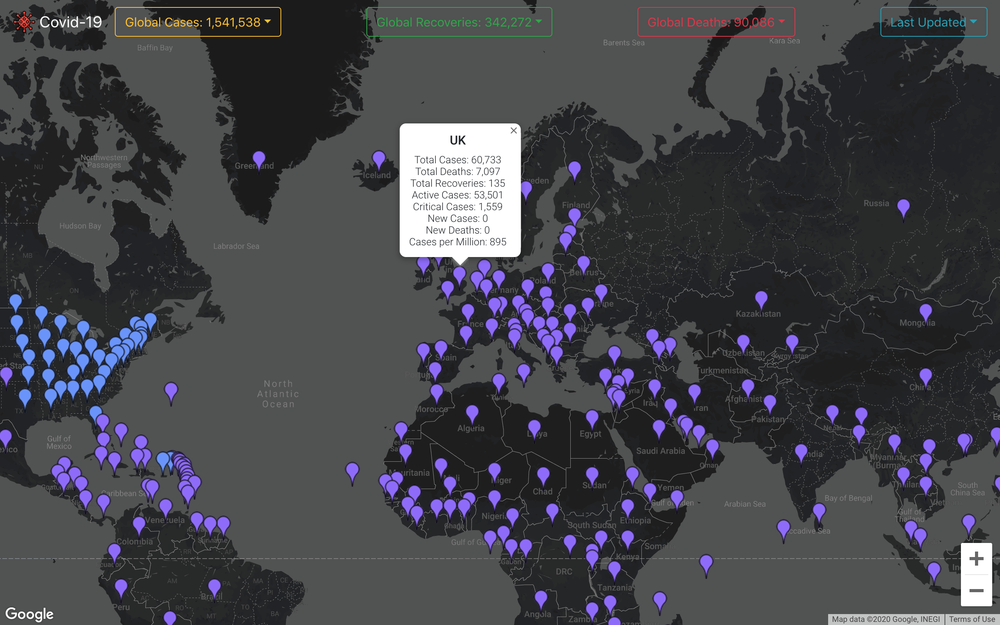

# Covid-19 Mapper

A global Covid-19 mapper, made on a single page React App. This used several API calls for the Covid-19 data, and a Google Map API displaying the countries data geographically. Jest was used for testing, Heroku for deployment and Travis for Continuous Integeration. 

This was the first large Post-Makers project, and was made with a brand new piece of tech for us. [Asia](https://github.com/asiaellis5), [Nic](https://github.com/nicolasraffray) and I decided to use the React JavaScript library to display the current world data of COVID-19 pandemic. This was for 2 main reasons. Firstly, the best way to learn was by 'doing'. The second was that this was a topic that was affecting us and the world at the time of production. We were quarantined, had a drastic change of pace since graduating, and thought we would try to shed further light on the pandemic situation for the public.

'Stage 1', our MVP, was to have an interactive map that a user can click on to display the current statistics for that country. This took a week to achieve (the original repo can be found [_here_](https://github.com/nicolasraffray/covid-mapper) showing how we got to that point). A user could click on the marker, which would then display the current info in an infowindow. As a 'Stage 2' we decided to represent the mortality and infection rates by replacing the markers on the map with circles. These circles would then change in size and colour depending on the data coming in from the Covid API - when clicked on, the data was then changed from being displayed in an infowindow, to being displayed on the bottom of the screen in it's own section that would render independantly. 

---

## How to Run

Clone this repo, navigate to the [_test-app_](test-app) directory and in the command line type:

```
npm install
```

Once the dependencies are installed, type in the command line:

```
npm start
```

This will start the local server which can be accessed at [_localhost:3000_](http://localhost:3000/)

The project is also hosted live on [_Heroku_](https://covid-mapper.herokuapp.com/), visit via Google Chrome.

---

## How to Run Tests

Jest and Enzyme were used for testing. To run, in the command line type:


```
npm test
```

This will display all of tests and snapshot tests.

---

## Stage 1


---

## Stage 2


---